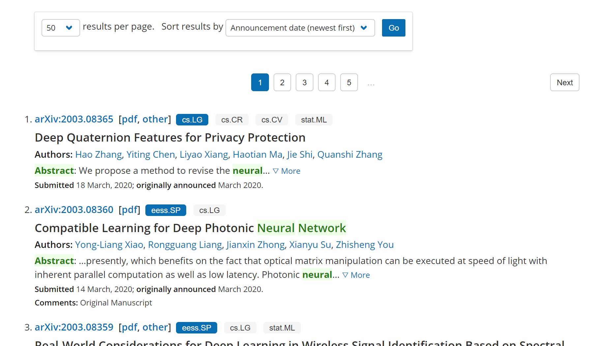
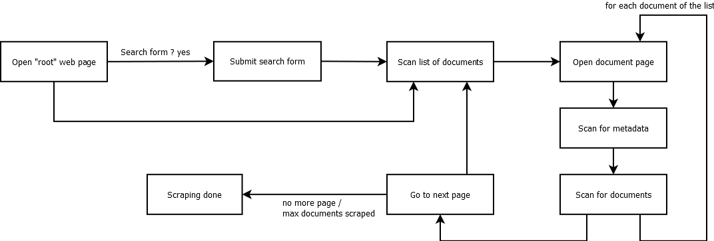

# Document scraping tools
Scraping framework to retrieve lists of articles, like RFP websites.

## What ?

We want to scrap documents from websites that display list of documents after a search.
Here is a web site example (arXiv):


The scraping tool should be configurable to allow:
* retrieval of several linked documents for each item
* retrieval of metadata for each item

We must also handle two kind of websites:
* "full html" websites that can be scraped with `requests`/`lxml` kind of tools
* "javascript" modern websites that requires tools like [Selenium](https://selenium-python.readthedocs.io/)

The image below shows the scraping workflow.



## Solution

The package contains a set of configurable scraping tools. Here is a simple example to launch a scraper:

```python
from documentscraper import load_config, RequestScraper
config = load_config("samples/arxiv.json")
scraper = RequestScraper(config)
scraper.run(output_folder="path/to/output")
```

Here is a configuration example for arXiv website:

```json
{
	"root_url": "https://arxiv.org/search/cs",
	"base_url": "https://arxiv.org",
	"form": {
		"term": "deep learning"
	},
	"next_page": "xpath_to_next_page_link"
	"item": {
		"selector": "xpath_to_element_in_list",
		"navigation": [
			"xpath_to_link_of_subpage"
		],
		"output": {
			"id": {
				"xpath": "xpath_to_id_element"
			},
			"metadata": {
				"author": {
					"xpath": "xpath_expression_to_author"
				},
				"date": {
					"xpath": "xpath_expression_to_date",
					"regex": "Submitted on (.*)"
				}
			}
			"files": [
				{
					"navigation" : [ "xpath_to_subpage" ],
					"xpath: "xpath_expression_to_file",
					"format": "auto",
					"filename": {
						"xpath": "xpath_to_filename",
						"regex": "/e-print/(.*)"
					}
				},
				{
					"xpath: "xpath_expression_to_file",
					"format": "pdf",
					"filename": {
						"xpath": "xpath_to_filename",
						"regex": "/pdf/(.*)"
					}
				}
			]
		}
	}
}
```
